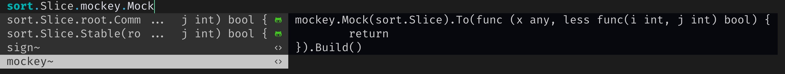

# cmp-sign

# v0.0.2
You must update **gopls** to v0.17.0, because the *document/signature* had a great changed.
[See more details](https://github.com/golang/tools/blob/master/gopls/doc/release/v0.17.0.md)

Of course, v0.0.1 is also works, which use *document/hover* is not recommand to query a signature.


# What is this?
Nvim completion source for [nvim-cmp](https://github.com/hrsh7th/nvim-cmp) and [blink.cmp](https://github.com/Saghen/blink.cmp).

Get the sign of the function, for example:

input:
`sort.Slice.sign`

output:
`func (x any, less func(i int, j int) bool)`


Support [mockey](https://github.com/bytedance/mockey), which is useful when making a test for ur code. 



You can custom completion menu:

The key will display on the completion menu.
*{{name}}* will be replace by function name, and *{{sign}}* will replace by function sign.

```
require('cmp_sign').setup({
	good = "xxx{{name}}xxxx{{sign}}",
})
```

# install

## Packer
```
use { 'crazyhulk/cmp-sign' }
```
## Lazy
```
{ 'crazyhulk/cmp-sign'}
```

# Setup

for nvim-cmp users:

```

require'cmp'.setup {
  sources = {
    { name = 'nvim_cmp_sign' }
  }
}
```
for saghen/blink.cmp users:

Make sure [blink.compat](https://github.com/saghen/blink.compat) is installed.
```
sources = {
	default = { 'nvim_cmp_sign', 'lsp', 'path', 'snippets', 'buffer', 'copilot' },
	providers = {
		nvim_cmp_sign = {
			name = "nvim_cmp_sign",
			module = 'blink.compat.source',
			-- score_offset = -3,
			opts = {},
		},
	},
},

```
